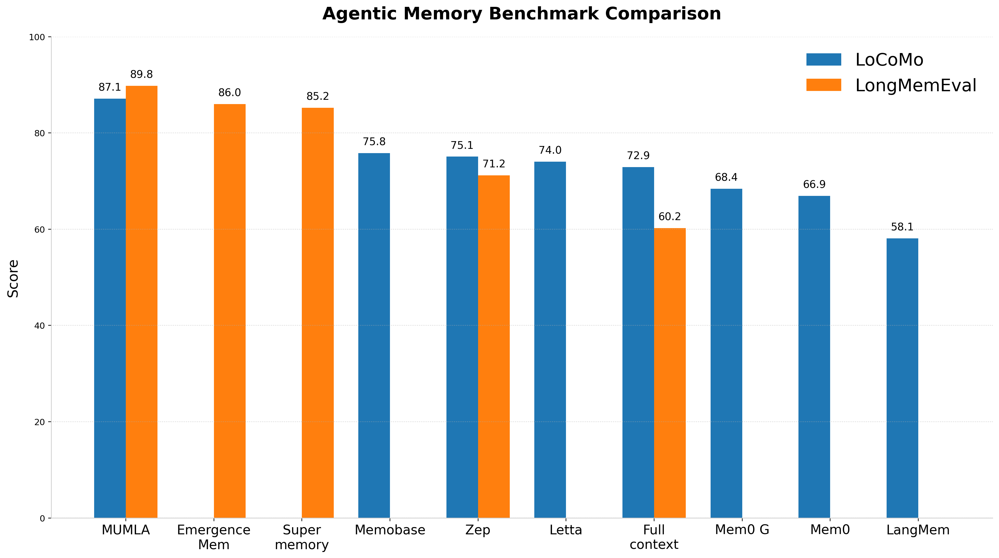

# Stop Overengineering Agentic Memory: How Basic RAG Outperforms the Leading Memory Frameworks

**Why complex graph-based memory architectures may be overkill, and how simple, highly-optimized RAG can achieve state-of-the-art results.**

## The Rush for Persistent Memory
As LLM-powered applications have quickly evolved from single-prompt chatbots into robust, autonomous agents handling complex, multi-session workflows. As such, developers have faced an increasing need for persistent, highly accurate memory. Agentic AI in its current state is locked in an arms race to develop the ultimate long-term memory system.

In just the last year alone, we've seen a wave of dedicated memory tools surface, such as Mem0, Zep, Supermemory, and Hindsight. This demand has driven the industry toward increasingly complex solutions, from intricate knowledge graphs to multi-layered parallel retrieval pipelines. Amidst this rush to build the most sophisticated architectures, we wanted to take a step back and see just how far we could push using a standard RAG implementation.

## The Problem With Long-Term Memory
If you feed a modern LLM a short, contained conversation history, it can easily follow complex instructions and synthesize disjointed facts into a coherent answer. The underlying reasoning capabilities of foundational models are excellent. The problem arises when conversations span thousands of messages across dozens of distinct, historical sessions.

Extracting the *right* fragments from a massive historical corpus to fit within a constrained context window remains the primary bottleneck for true agentic memory. Even with today's massive context windows, indiscriminately dumping months of history degrades reasoning capabilities, leading to hallucinations and exorbitant inference costs.

To solve this, competitors have largely turned to complex graph databases. The prevailing theory is that by explicitly mapping relationships between entities (e.g., User -> prefers -> Python) using Knowledge Graphs or hybrid semantic-graph engines, agents can traverse these nodes to find answers. While effective, this approach introduces massive overhead: managing schemas, handling graph ingestion latency, and writing complex traversal queries.

## Challenging the Status Quo
At Moorcheh, we built a highly-optimized Semantic Engine from the ground up to solve the "RAM Tax" of traditional vector databases. By moving away from bloated, in-memory HNSW + Cosine distance stacks in favor of information-theoretic retrieval, we created an engine capable of sub-40ms serverless latency across 100k+ namespaces.

When we started brainstorming to build **MUMLA**, our Universal Memory Layer for Agentic AI, we hit a crossroads. The industry consensus told us our fast vector search alone wouldn't be enough for complex memory retrieval tasks. The prevailing wisdom insisted we needed to bolt a complex graph database on top of it.

We asked ourselves a simple question: **Is all this graph database complexity really necessary?** 

Before committing to the massive engineering overhead of building a hybrid semantic-graph engine, we wanted to see just how far we could push the fundamentals. What happens if you take a standard RAG pipeline, strip away the complexities, and just rely on Moorcheh's high-quality semantic search to power MUMLA?

To find out, we ran a comprehensive benchmarking progression on MUMLA using the `locomo` and `longmem` datasets. Our goal was straightforward, skip the multi-layered graph orchestration and test if a highly capable, pure semantic memory layer could match or beat the accuracy of complex agentic memory architectures.

---

## Establishing the Baseline
We started with a standard "Naive RAG" implementation to establish a performance floor.
- **Methodology**: Simple semantic search against ingested memory chunks.
- **Parameters**: 
  - **Retrieval Limit**: Top 10 chunks.
  - **Similarity Threshold**: 0.15 ITS score.
  - **Model**: Claude Sonnet 4.

> **Baseline Accuracy:** LongMemEval: **56.6%** | LoCoMo: **76.2%**

---

## The "Top-K" Bottleneck: Why Strict Semantic Search Fails
A common paradigm in standard RAG architectures is to aggressively constrain the retrieval limit (often to a top-10 chunk `k`-value) to save tokens and reduce model confusion. Our early tests quickly exposed this as a major bottleneck for agentic memory.

Many complex user queries in the LongMemEval and LoCoMo datasets reference events scattered across multiple, disjoint sessions. Relying on strict semantic search to surface *every* relevant piece of a multi-hop reasoning chain within a tight 10-chunk constraint is nearly impossible.

When we relaxed this constraint—increasing the retrieval limit to 40 chunks and lowering the similarity threshold from 0.15 to 0.10, the results were immediate.

> **Accuracy (k=40):** LongMemEval: **77.0%** *(+20.4%)* | LoCoMo: **82.8%** *(+6.6%)*

The takeaway is clear, the semantic search "precision vs. recall" trade-off in agentic memory skews heavily toward recall. While there is an absolute ceiling where dumping the entire conversation history ("full context") begins to degrade the LLM's reasoning and spike costs, aggressive precision filtering at the retrieval layer is equally dangerous. It is far better to retrieve noisy chunks and let a capable LLM filter the context than to miss critical fragments entirely.

---

## The Limits of Prompt Engineering vs. Core Architecture
With a wider retrieval net cast, we turned our attention to the LLM's interpretation of the data. 

In agentic evaluation pipelines, you are often battling two LLMs: the Answerer (which can suffer from perceived ambiguities and refuse to answer) and the Judge (which can rigidly reject semantically correct answers that don't match the ground truth phrasing). To ensure an apples-to-apples baseline with other frameworks, we adopted and modified prompts from the [*Hindsight*](https://github.com/vectorize-io/hindsight) repository.

> **Accuracy (Optimized Prompts):** LongMemEval: **79.2%** *(+2.2%)* | LoCoMo: **82.9%** *(+0.1%)*

While we observed a slight accuracy bump in LongMemEval's complex reasoning tasks, LoCoMo remained largely static. The reality is that prompt engineering is a band-aid for structural retrieval deficits. If the memory architecture isn't surfacing the data, no amount of prompt tuning will synthesize an accurate answer. As foundational models grow stronger, the reliance on rigid prompting frameworks for complex reasoning will diminish.

---

## Why Modern LLMs Tolerate Noisy Context
Analyzing our failure cases revealed that incorrect answers weren't caused by the LLM getting "confused" by the expanded 40-chunk context window. Rather, semantic search was *still* missing critical, needle-in-a-haystack sentences embedded within largely irrelevant chunks.

To see if raw recall was the answer, we pushed the architecture further, expanding the dynamic retrieval limit to a maximum of **100 chunks** and dropping the similarity threshold to **0.05**. It is important to note that we aren't just blindly dumping 100 chunks into every prompt, the chunk retrieval is dynamic and based on Moorcheh's Information Theoretic Score (ITS), meaning it only retrieves up to 100 chunks if they meet the similarity threshold.

> **Accuracy (k=100):** LongMemEval: **85.0%** *(+5.8%)* | LoCoMo: **86.3%** *(+3.4%)*

The continued, massive improvements validate a critical shift in how we should build agentic memory. High-dimensional vector search engines can be fooled by chunks containing multiple topics (e.g., a chunk that is 90% irrelevant but contains one critical detail). Because multi-session questions require synthesizing facts scattered across time, giving the semantic engine a wider runway to surface those disparate fragments proves far more effective than trying to engineer a hyper-precise vector query.

---

## The Cost of Overengineering: Summaries vs. Scale
We did briefly experiment with structural memory changes, specifically generating **Session Summaries** and **Global Summaries** to highlight critical sentences that raw chunk retrieval might miss. 

While these architectural additions provided additional accuracy improvements, they introduced a noticeable tax on token consumption during ingestion and we concluded that the trade-off wasn't worth it. For teams looking to squeeze out the final few percentage points of accuracy, adopting highly complex memory architectures might seem like the logical next step, but it is clearly not a prerequisite for high performance.

---

## Inference Matters: The Jump to Gemini 3
For our final evaluation pass, we switched the underlying inference model from Claude Sonnet 4 to **Gemini 3**. Beyond solving the "needle in a haystack" retrieval problem, we needed an LLM capable of advanced multi-hop reasoning and complex context synthesis. This transition also established parity with other leading agentic systems that use Gemini 3 for their benchmarks.

#### LongMemEval Final Results
| Single-session User | Single-session Assistant | Single-session Preference | Knowledge Update | Temporal Reasoning | Multi-session | Overall |
| :--- | :--- | :--- | :--- | :--- | :--- | :--- |
| **95.7%** | **100.0%** | **93.3%** | **93.6%** | **88.0%** | **81.2%** | **89.8%** *(+4.8%)* |

#### LoCoMo Final Results
| Single-Hop | Multi-Hop | Open Domain | Temporal | Overall |
| :--- | :--- | :--- | :--- | :--- |
| **78.7%** | **70.8%** | **92.4%** | **85.4%** | **87.1%** *(+0.8%)* |

---

| System | LoCoMo Score | LongMemEval Score | Memory Architecture | Retrieval Strategy | Querying Method |
| :--- | :---: | :---: | :--- | :--- | :--- |
| Hindsight | 89.61% | 91.4% | Hybrid (Graph + Vector) | Parallel | Recursive Querying |
| **MUMLA** | **87.1%** | **89.8%** | **Vector Only** | **RAG** | **Single Query** |
| EmergenceMem | — | 86.0% | Hybrid (Graph + Vector) | Parallel | Multi-Query |
| Supermemory | — | 85.2% | Hybrid (Graph + Vector) | Parallel | Multi-Query |
| Memobase | 75.8% | — | Hybrid (Graph + Vector) | Parallel | Single Query |
| Zep | 75.1% | 71.2% | Hybrid (Graph + Vector) | Parallel | Single Query |
| Letta | 74.0% | — | Local Filesystem | RAG | Recursive Querying |
| Full context | 72.9% | 60.2% | Vector Only | RAG | Single Query |
| Mem0 G | 68.4% | — | Hybrid (Graph + Vector) | Parallel | Single Query |
| Mem0 | 66.9% | — | Vector Only | Parallel | Single Query |
| LangMem | 58.1% | — | Vector Only | RAG | Single Query |

## The Overhead and Latency Trade-off

As the comparison table illustrates, top scores in agentic memory benchmarks are usually achieved through extensive architectural complexity. Most top-performing systems rely on hybrid setups combining Knowledge Graphs with Vector Databases.

While these methods may yield high benchmarks, they force a severe trade-off in operational overhead. Knowledge graphs, don't just magically map connections. Every time new conversational data is ingested, the framework must invoke an LLM to read the message, extract relevant entities, and define the relationships connecting them. This turns the simple act of *saving a memory* into a compute-heavy, synchronous process that utilizes tokens and incurs latency before the agent has even answered the user's question.

Beyond ingestion, retrieval itself introduces penalties. Multi-query and recursive generation strategies multiply the number of LLM inference calls required per user interaction, significantly increasing response times in production environments.

In contrast, MUMLA simply ingests raw conversational chunks directly into its vector store, bypassing the LLM extraction tax entirely. Despite relying on this instant ingestion and a single unified query on retrieval, MUMLA achieves state-of-the-art accuracy **89.8% on LongMemEval and 87.1% on LoCoMo**. This demonstrates that heavily optimized semantic retrieval can match and often beat complex orchestration without forcing developers to pay a compounding latency and token tax.

---

## The Future of Agentic AI Memory
The next phase of agentic AI will not be won by the most complicated memory diagram. It will be won by architectures that balance retrieval quality and reasoning performance with low inference costs and minimal latency at production scale. Our results suggest that strong, highly-optimized semantic infrastructure can already deliver state-of-the-art memory performance without forcing heavy graph orchestration or expensive recursive LLM loops.

Going forward, the path is simple: keep the memory system lean, make retrieval consistent and accurate, and track results with clear benchmarks. While complex architectures can work, they come at a premium in both compute and latency. Hitting **89.8%** on LongMemEval and **87.1%** on LoCoMo with MUMLA proves that highly optimized retrieval can achieve state-of-the-art accuracy without forcing developers to pay for that premium.
